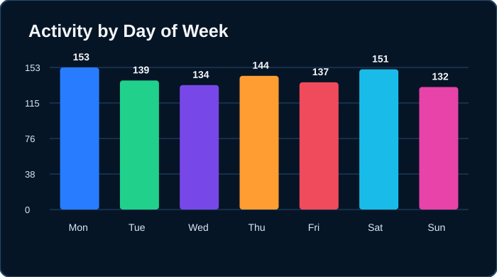

# 👋 Hi, I'm Rohit Yadav

### BCA Student | Aspiring Web Developer | Tech Enthusiast

Building projects • Learning new technologies • Creating a better tomorrow

---

## 📊 GitHub Overview

| 🔥 Current Streak | 🏆 Longest Streak | 💻 Commits (1Y) | 🟩 Contributions (1Y) | 📦 Repositories |
|:---:|:---:|:---:|:---:|:---:|
| **91 days** | **91 days** | **969** | **1,015** | **33** |

---

## 🟩 Contribution Activity

---

## 💻 Coding Activity

<table>
<tr>
<td width="50%">

### 📚 Most Used Languages

| Language | Usage |
|---|---:|
| 🐍 Python | **94.3%** |
| 🌐 HTML | **2.5%** |
| 🎨 CSS | **1.6%** |
| ⚡ JavaScript | **1.4%** |
| 💻 PowerShell | **0.1%** |
| 🔵 C | **0.1%** |

</td>

<td width="50%">

### 🔥 Coding Streak

**Current Streak**

# 91 days

**Longest Streak**

# 91 days

> 🟢 Live GitHub activity — updated automatically.

</td>
</tr>
</table>

---

## 👨‍💻 Developer Profile

<table>
<tr>
<td width="25%">

### 🐍 Python

Django • FastAPI • Pandas

</td>

<td width="25%">

### 🌐 Web Development

HTML • CSS • JavaScript • Bootstrap

</td>

<td width="25%">

### 💻 Programming

Java • C • Data Structures

</td>

<td width="25%">

### 🗄️ Database

PostgreSQL • SQLite • SQL

</td>
</tr>
</table>

---

## 📈 Live GitHub Metrics

| Contributions | Commits | Repositories | Followers | Stars |
|:---:|:---:|:---:|:---:|:---:|
| **1,015** | **969** | **33** | **7** | **0** |

---

### ⚙️ GitHub Activity

Updated automatically by **GitHub Actions** • Live data from GitHub API

**Code → Learn → Build → Improve → Repeat 🚀**

